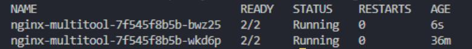
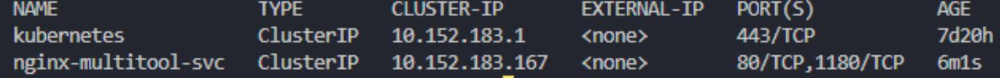
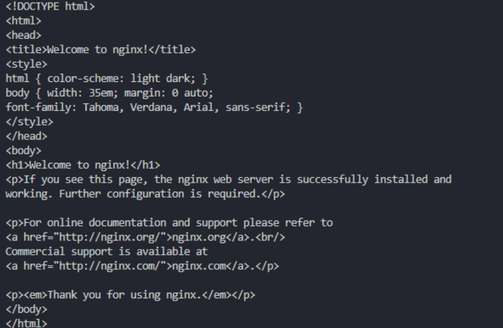

# Домашнее задание к занятию «Запуск приложений в K8S»

### Задание 1. Создать Deployment и обеспечить доступ к репликам приложения из другого Pod

1. Создать Deployment приложения, состоящего из двух контейнеров — nginx и multitool. Решить возникшую ошибку.
создаем конфиг
[deployment.yaml](./files/deployment.yaml)

Предсказанная проблема это конфликт портов. и nginx и mulititool используют 80\443 порты.  

В документации mulititool:

```
You can pass additional parameter --namespace=<your-desired-namespace> to the above kubectl command. 
Due to a possibility of something (some service) already listening on port 80 and 443 on the worker nodes, the daemonset is configured to run multitool on port 1180 and 11443.   You can change this in the YAML file if you want.  
```

Соответственно указываем параметр окружения для запуска мультитула на 1180  

В качестве полной цепочки решения:  

```
kubectl describe pods nginx-multitool-64bddb88d-jglzd    
kubectl logs -p nginx-multitool-64bddb88d-jglzd -c multitool  
```

Видим конфликт:  
2025/03/13 10:09:54 [emerg] 1#1: bind() to 0.0.0.0:80 failed (98: Address in use)  
nginx: [emerg] bind() to 0.0.0.0:80 failed (98: Address in use)  

Разрешим его в конфиге:

```
kubectl apply -f .\files\deployment.yaml  
kubectl get pods  
kubectl describe pods nginx-multitool-64bddb88d-jglzd  
```


2. После запуска увеличить количество реплик работающего приложения до 2.

```
kubectl scale deployment nginx-multitool --replicas=2  
```

или меняем в yaml конфиге ( replicas: 2 ) и применяем его заново

3. Продемонстрировать количество подов до и после масштабирования.

```
kubectl get pods  
```



4. Создать Service, который обеспечит доступ до реплик приложений из п.1.

Создаем конфиг для сервиса:  
[svc.yaml](./files/svc.yaml)  
Применяем:

```
kubectl apply -f .\files\svc.yaml
```

Проверяем:

```
kubectl get svc 
```

  

5. Создать отдельный Pod с приложением multitool и убедиться с помощью `curl`, что из пода есть доступ до приложений из п.1.

Создаем конфиг для сервиса:  
[svc.yaml](./files/multitool.yaml)  

Применяем:

```
kubectl apply -f .\files\multitool.yaml 
```

Подключаемся:

```
kubectl exec -it multitool-test -- /bin/sh  
curl nginx-multitool-svc    
```

   

### Задание 2. Создать Deployment и обеспечить старт основного контейнера при выполнении условий

Создаем конфиги deployments2 и svc2:
[deployments2.yaml](./files/deployment2.yaml)
[svc2.yaml](./files/svc2.yaml)

Для проверки будем использовать цикл until в bash
<https://routerus.com/bash-until-loop/>

Работает так:

<<<<<<< HEAD
```
=======
Работает так     
``` 
>>>>>>> c51462c3970762a807e417d9b230747317b5a862
until ping 192.168.251.1&> /dev/null;   
do  
    echo "Waiting for the  host ...";   
    sleep 1;    
done;   
<<<<<<< HEAD
```
=======
``` 
Использем nslookup, Ip пода это нестабильная сущность.  
>>>>>>> c51462c3970762a807e417d9b230747317b5a862

Используем nslookup, Ip пода это нестабильная сущность.  

Применяем:

```
kubectl apply -f .\files\deployment2.yaml
```

<<<<<<< HEAD
Проверяем:

```
=======
проверяем состояние пода    
``` 
>>>>>>> c51462c3970762a807e417d9b230747317b5a862
kubectl get pods    
```

Он в состоянии init, как и задумано.

```
kubectl apply -f .\files\svc2.yaml  
<<<<<<< HEAD
```

Проверяем:

=======
``` 
проверяем состояние пода   
>>>>>>> c51462c3970762a807e417d9b230747317b5a862
```  
kubectl get pods    
```


