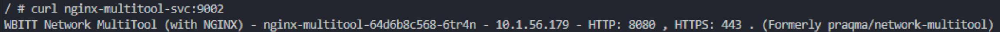

# Домашнее задание к занятию «Сетевое взаимодействие в K8S. Часть 1»

### Задание 1. Создать Deployment и обеспечить доступ к контейнерам приложения по разным портам из другого Pod внутри кластера

Создаем манифесты:

[Deployment](./files/deployment.yaml)  
[Service](./files/svc.yaml)

Применяем:

```
kubectl apply -f .\files\deployment.yaml 
kubectl apply -f .\files\svc.yaml 
```

Проверяем:

```
kubectl get deployments
kubectl get svc
kubectl run -it --rm --image=wbitt/network-multitool dns-test --restart=Never -- sh 
```

curl nginx-multitool-svc:9001  
  

curl nginx-multitool-svc:9002  
  

------

### Задание 2. Создать Service и обеспечить доступ к приложениям снаружи кластера

Создаем манифест:
[Service](./files/svc-nodeport.yaml)

Применяем:

```
kubectl apply -f .\files\svc-nodeport.yaml 
```

Проверяем:

```
kubectl get svc 
kubectl get nodes -o wide 
curl 192.168.253.203:30080 
```


