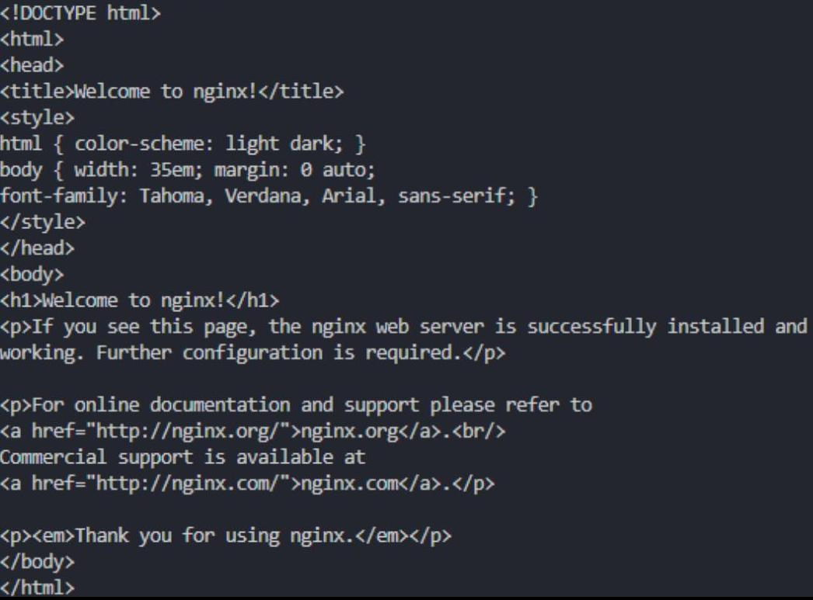
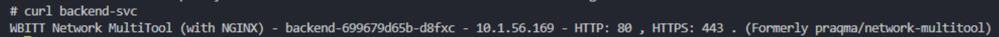
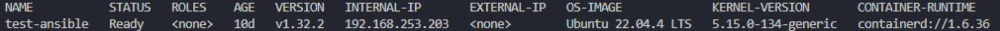
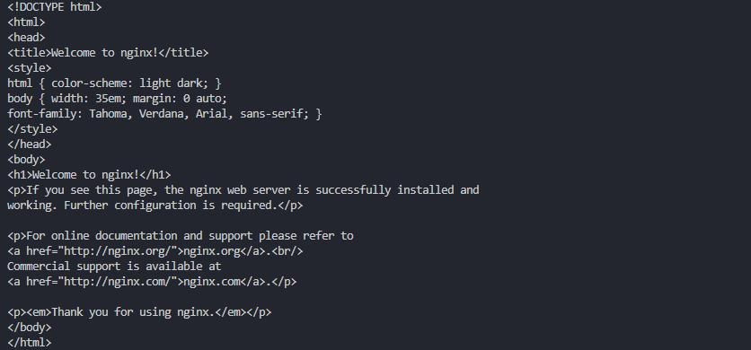

# Домашнее задание к занятию «Сетевое взаимодействие в K8S. Часть 2»

### Задание 1. Создать Deployment приложений backend и frontend

Создаем манифесты:  
[backend](./files/backend.yaml)  
[backend-svc](./files/backend-svc.yaml)  
[frontend](./files/frontend.yaml)  
[frontend-svc](./files/frontend-svc.yaml)  

Создаем ресурсы используя манифесты, проверяем:

```
kubectl apply -f .\files\backend-svc.yaml 
kubectl apply -f .\files\backend.yaml 
kubectl apply -f .\files\frontend-svc.yaml 
kubectl apply -f .\files\frontend.yaml 
kubectl get pods 
kubectl get deployments  
```

Проверяем frontend с backend:

```
kubectl exec -it backend-699679d65b-d8fxc -- /bin/sh 
curl frontend-svc 
```



Проверяем backend с frontend:

```
kubectl exec -it frontend-c8db67c9d-d9gz5 -- /bin/sh 
curl backend-svc 
```



### Задание 2. Создать Ingress и обеспечить доступ к приложениям снаружи кластера

Включаем ingress  контроллер на microk8s

```  
microk8s enable ingress  
```

Создаем манифест:
[ingress](./files/ingress.yaml)
  
Создаем  и проверяем:

```
kubectl apply -f .\files\ingress.yaml  
kubectl get node -o wide 
```



Для проверки вносим в /etc/hosts и проверяем:



------
