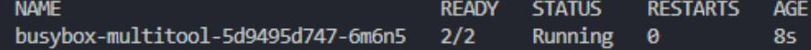
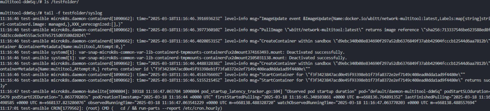

# Домашнее задание к занятию «Хранение в K8s. Часть 1»

### Задание 1

Создаем манифест:
[deployment](./files/deployment.yaml)

Применяем:  

```
kubectl apply -f ./files/deployment.yaml  
kubectl get po  
```

Проверяем:

```
kubectl exec -it busybox-multitool-5d9495d747-6m6n5 -c multitool -- bash  
ls /testfolder  
cat /testfolder/time.txt  
cat /testfolder/time.txt  
```

Видим, что записи в /testfolder/time.txt в контейнере multitool обновляется контейнером busybox:  
  

```
kubectl exec
busybox-multitool-5d9495d747-6m6n5:/# ls /testfolder
-it busybox-multitool-5d9495d747-6m6n5 -c multitool -- bash time.txt
busybox-multi tool-5d9495d747-6m6n5:/# cat /testfolder/time.txt
Sat Jul 18 10:56:56 UTC 2025
busybox-multi tool-5d9495d747-6m6n5:/# cat /testfolder/time.txt
Sat Jul 18 10:57:11 UTC 2025
busybox-multi tool-5d9495d747-6m6n5:/# cat /testfolder/time.txt
Sat Jul 18 10:57:16 UTC 2025
busybox-multi tool-5d9495d747-6m6n5:/# cat /testfolder/time.txt
```

------

### Задание 2

Создаем манифест:
[daemonset](./files/daemonset.yaml)

Применяем:  

```
kubectl apply -f ./files/daemonset.yaml
kubectl get po
```

Проверяем:

```
kubectl exec -it daemon-multitool-ddm5q -c multitool -- bash  
ls /testfolder/
tail -f /testfolder/syslog
```

Видим содержимое syslog  ноды test-ansible:

