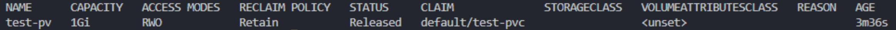
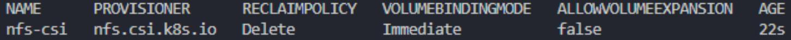
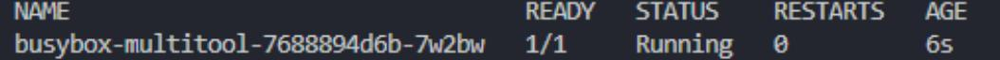
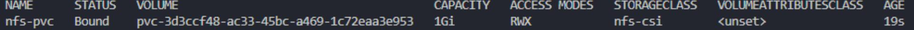
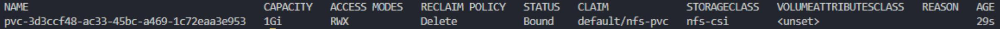
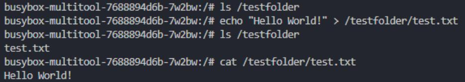

# Домашнее задание к занятию «Хранение в K8s. Часть 2»

### Задание 1

Создать Deployment приложения, использующего локальный PV, созданный вручную.

1. Создать Deployment приложения, состоящего из контейнеров busybox и multitool.

Манифест [Deployment](./files/deployment.yaml)

2. Создать PV и PVC для подключения папки на локальной ноде, которая будет использована в поде.

Манифест [pv](./files/pv.yaml)
Манифест [pvc](./files/pvc.yaml)

3. Продемонстрировать, что multitool может читать файл, в который busybox пишет каждые пять секунд в общей директории.

Применяем манифесты:  

```
kubectl apply -f .\files\pv.yaml  
kubectl apply -f .\files\pvc.yaml  
kubectl apply -f .\files\deployment.yaml  
```

Проверяем:  

```
kubectl get pv  
kubectl get pvc  
kubectl get po   
```

Обращаем внимание на статус pv - Bound означает, что произошла связка с pvc.  

Читаем файл от busybox:  

```
kubectl exec -it busybox-multitool-7fd498bf64-ktg9c -c multitool -- bash    
ls /testfolder  
cat /testfolder/time.txt  
```

```
kubectl
exec -it busybox-multitool-7fd498bf64-ktg9c -c multitool -- bash
busybox-multitool-7fd498bf64-ktg9c:/# ls /testfolder
time. txt
busybox-multitool-7fd498bf64-ktg9c:/# cat /testfolder/time.txt
Sat Jul 5 14:00:33 UTC 2025
Sat Jul 5 14:00:38 UTC 2025
Sat Jul 5 14:00:43 UTC 2025
Sat Jul 5 14:00:48 UTC 2025
Sat Jul 5 14:00:53 UTC 2025
```

4. Удалить Deployment и PVC. Продемонстрировать, что после этого произошло с PV. Пояснить, почему.

Удаляем и проверяем:  

```
kubectl delete -f .\files\deployment.yaml  
kubectl delete -f .\files\pvc.yaml  

kubectl get po  
kubectl get pvc  
kubectl get pv  
```

kubectl delete -f .\files\deployment.yaml
deployment.apps "busybox-multitool" deleted
kubectl delete -f .\\files\pvc.yaml
persistentvolumeclaim "test-pvc" deleted
kubectl get pods
No resources found in default namespace.
kubectl get pvc
No resources found in default namespace.



Статус pv изменился на Released.  
Pod использовавший pvc был удален. никакой процесс больше не использовался самим pvc, это позволило его так же удалить.  
При этом пропала связь между pvc и pv и pv теперь можно связать с другим, подходящим по условиям  pvc.  

5. Продемонстрировать, что файл сохранился на локальном диске ноды. Удалить PV.  Продемонстрировать что произошло с файлом после удаления PV. Пояснить, почему.

На ноде:  

```
ls /mnt/tmp
time.txt
```

Теперь  

```
kubectl delete -f .\files\pv.yaml  
kubectl get pv  
No resources found  
```

Снова проверяем на ноде:  

```
ls /mnt/tmp  
```

```
cat /mnt/tmp/time.txt
Sat Jul 5 14:47:03 UTC 2025
Sat Jul 5 14:47:08 UTC 2025
Sat Jul 5 14:47:13 UTC 2025
```

Файл и его содержимое будет там присутствовать без изменений. происходит это потому, что pv позволяет лишь получить доступ к хранилищу, при этом им не являясь.
Поэтому с файлами ничего не произошло, даже после удаления pv.

------

### Задание 2

Создать Deployment приложения, которое может хранить файлы на NFS с динамическим созданием PV.

1. Включить и настроить NFS-сервер на MicroK8S.

Настраиваем nfs шару и sc microk8s по инструкции:  
<https://microk8s.io/docs/how-to-nfs>  

Манифест [sc](./files/sc.yaml)

Проверяем:

```
kubectl get storageclasses  
```



2. Создать Deployment приложения состоящего из multitool, и подключить к нему PV, созданный автоматически на сервере NFS.

Манифест [deployment](./files/deployment2.yaml)  
Манифест [PVC](./files/nfs-pvc.yaml)

Создаем ресурсы и проверяем:  

```
kubectl apply -f ./files/nfs-pvc.yaml  
kubectl apply -f ./files/deployment2.yaml  
kubectl get po  
kubectl get pvc  
kubectl get pv  
```





3. Продемонстрировать возможность чтения и записи файла изнутри пода.

Подключаемся к контейнеру:  

```
kubectl get po -o wide   
kubectl exec -it busybox-multitool-7688894d6b-7w2bw -c multitool -- bash   
```

Проверяем:

```
ls /testfolder  
echo "Hello World!" > /testfolder/test.txt  
ls /testfolder  
cat /testfolder/test.txt  
```



Проверяем так же на ноде с шарой:  

```
cat /mnt/nfs/pvc-3d3ccf48-ac33-45bc-a469-1c72eaa3e953/test.txt   
Hello World!  
```
