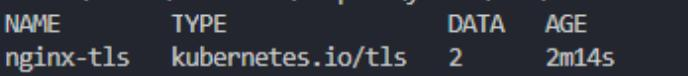

# Домашнее задание к занятию «Конфигурация приложений»

### Задание 1. Создать Deployment приложения и решить возникшую проблему с помощью ConfigMap. Добавить веб-страницу

Создаем манифесты:  
[api-html](./files/sc.yaml)
[deployment](./files/sc.yaml)  
[svc-nodeport](./files/svc-nodeport.yaml)

Проблема в использовании 80го порта обоими контейнерами.
Передаем env переменную используя ConfigMap.
Через ConfigMap передаем файл index.html  в базовое расположение nginx с содержимым "Hello word!"

Создаем ресурсы:  
kubectl apply -f ./files/api-html.yaml  
kubectl apply -f ./files/deployment.yaml  
kubectl apply -f ./files/svc-nodeport.yaml  

Проверяем:  

kubectl get configmaps  
  
рkubectl get pods  
  
kubectl describe config maps api-html  
  

```
curl 192.168.253.203:30080  

StatusCode
: 200
StatusDescription : OK
Content
: <html> <body> <h1>"Hello Word!"</h1> </body> </html>
RawContent
: HTTP/1.1 200 OK
Connection: keep-alive
Accept-Ranges: bytes
Content-Length: 52
Content-Type: text/html
Date: Sat, 5 Jul 2025 15:43:57 GMT
ETag: "67dd4b8b-34"
Last-Modified: Sat, 5 Jul 2025 15…
Forms
:
Headers
: {[Connection, keep-alive], [Accept-Ranges, bytes], [Content-Length, 52], [Content-Type, text/html]…}
Images
:
InputFields
Links
: }
ParsedHtml
: mshtml.HTMLDocumentClass
RawContentLength : 52
```

### Задание 2. Создать приложение с вашей веб-страницей, доступной по HTTPS

Создаем самоподписанный сертификат:

```
openssl req -x509 -nodes -days 365 -newkey rsa:2048 -keyout tls.key -out tls.crt -subj "/CN=test-netology.com/0=test-netology.com"  
```

Кодируем  в base64:  

```
base64 -w 0 tls.crt  
base64 -w 0 tls.key  
```

Создаем манифесты.  
Проверяем, чтобы не было лишних пробелов в конце ключей, в секретах!  

[secret-tls](./files/secret-tls.yaml)  
[api-html](./files/api-html.yaml)  
[deployment2](./files/deployment2.yaml)  
[svc-nodeport](./files/svc-nodeport.yaml)  
[ingress](./files/ingress.yaml)

Создаем ресурсы. configmaps в первую очередь:  

```
kubectl apply -f ./files/secret-tls.yaml  
kubectl apply -f ./files/api-html.yaml  
kubectl apply -f ./files/deployment2.yaml  
kubectl apply -f ./files/svc-nodeport.yaml  
kubectl apply -f ./files/ingress.yaml   
```

Проверяем  секреты:  

  


Проверяем доступ. с ключем -k (так как, сертификат самоподписанный)  

```
curl -k https://test-netology.com  

<<html> <body> <h1>"Hello World!"</h1> </body> </html>
```
