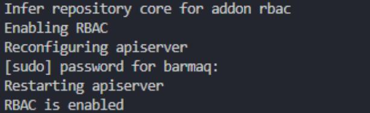
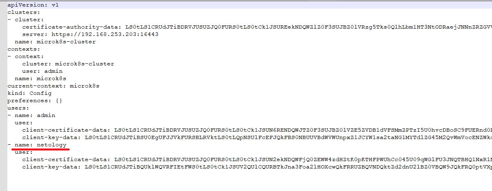
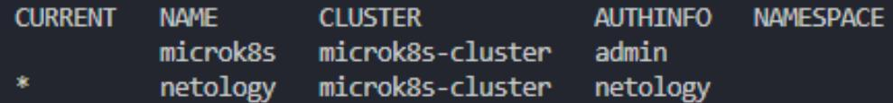
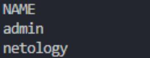
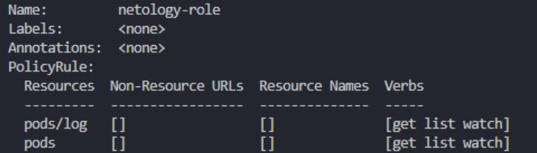
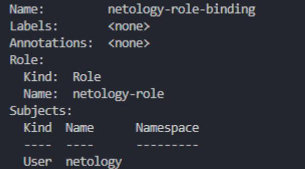

# Домашнее задание к занятию «Управление доступом»


### Задание 1. Создайте конфигурацию для подключения пользователя

1. Создайте и подпишите SSL-сертификат для подключения к кластеру.

На кластере:  

Создаем ключ:  
```
openssl genrsa -out netology.key 2048  
 ``` 
Теперь запрос на создание серта. subject это имя пользователя:  
```
openssl req -new -key netology.key -out netology.csr -subj "/CN=netology/O=ops"  
```

Смотрим:  
```
cat netology.csr  
```
    
Нужно выпустить ключ сроком жизни до 500 дней.  
```
openssl x509 -req \  
-in netology.csr \  
-CA /var/snap/microk8s/current/certs/ca.crt \  
-CAkey /var/snap/microk8s/current/certs/ca.key \  
-CAcreateserial \  
-out netology.crt \  
-days 500  
```

Итоговые netology.crt и netology.key передаем клиенту.  

  
2. Настройте конфигурационный файл kubectl для подключения.


Включаем на кластере:  
```
microk8s enable rbac  
```

  

На клиенте:  
Создадим нового юзера через kubectl:  
```
kubectl config set-credentials netology --client-certificate=./files/netology.crt --client-key=./files/netology.key --embed-certs=true  
User "netology" set.
```

Проверяем:  
```
cat ~./kube/config  
```
Появился дополнительный пользователь - name: netology.

  


Теперь нужно создать новый контекст:  
```
kubectl config set-context netology --cluster=microk8s-cluster --user=netology  
kubectl config use-context netology  
kubectl config get-contexts  
kubectl config get-users  
```

```
kubectl config set-context netology --cluster-microk8s-cluster --user=netology
Context "netology" modified.
kubectl config use-context netology
Switched to context "netology".
```
  



Проверяем:  
```
kubectl get nodes   
```
Доступа нет. все правильно. 
 
```
Error from server (Forbidden): nodes is forbidden: User "netology" cannot list resource "nodes" in API group "" at the cluster scope
```


3. Создайте роли и все необходимые настройки для пользователя.

Добавляем роли и права.  

Переключаемся обратно на пользователя с полными правами:  
```
kubectl config use-context microk8s  
```

Создаем роль   
[role.yaml](./files/role.yaml)  

```
kubectl apply -f ./files/role.yaml  
```
Проверим:   
```
kubectl describe role netology-role  
```

  

Теперь надо создать role-binding:  
[role-binding.yaml](./files/role-binding.yaml)  

```  
kubectl apply -f ./files/role-binding.yaml  
```
Проверим:  
```
kubectl describe rolebinding netology-role-binding  
```

  

4. Предусмотрите права пользователя. Пользователь может просматривать логи подов и их конфигурацию (`kubectl logs pod <pod_id>`, `kubectl describe pod <pod_id>`).

В манифесте роли, дали доступ к ресурсам pods и pods/log и к операциям  get, list, watch  

Создаем под для проверки:   
```
kubectl run multitool --image=wbitt/network-multitool  
```

Переключаемся на пользователя netology:  
```
kubectl config use-context netology  
```

Проверяем:  
```
kubectl get pods  
kubectl logs multitool  
kubectl describe multitool  
```
------

Name:  
multitool  
Namespace:  
default  
Priority:  
Service Account: default  
Node:  
test-ansible/192.168.253.203  
Start Time:  
Sat, 5 Mar Jul 18:34:47 +0300  
Labels:  
run-multitool  
Annotations:  
cni.projectcalico.org/containerID: 4922256df858c692f2e0c9564a930340a802c606dd6237b890c2ece2e0e60c75  
cni. projectcalico.org/podIP: 10.1.56.139/32  
cni. projectcalico.org/podIPs: 10.1.56.139/32  
Status:  
Running  
IP:  
10.1.56.139  
IPs:  
IP: 10.1.56.139  
Containers:  
multitool:  
Container ID: container://98bae820d7caa2543e60937cb051cffb39d343111bf18eac1dc54754d38ed5f7  
Image:  
wbitt/network-multitool  
Image ID:  
docker.io/wbitt/network-multitool@sha256:d1137e87af76ee15cd0b3d4c7e2fcd111ffbd510ccd0af076fc98dddfc50a735

------

Пробуем посмотреть, что то из ресурсов вне рамок роли.  
Получаем сообщение о ограничении в правах.  

```
kubectl get svc

Error from server (Forbidden): services is forbidden: User "netology" cannot list resource "services" in API group "" in the namespace "default"
```
```
kubectl get nodes

Error from server (Forbidden): nodes is forbidden: User "netology" cannot list resource "nodes" in API group "" at
the cluster scope
```
