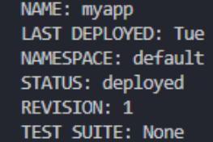
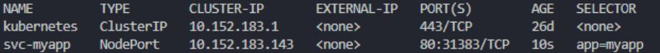
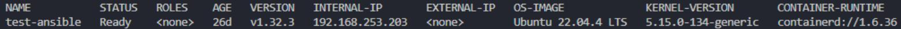
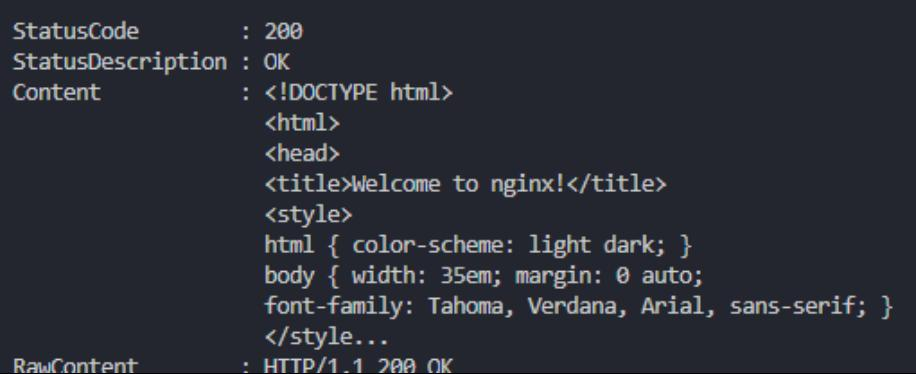
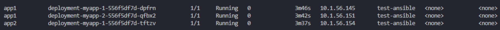
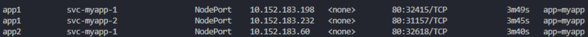

# Домашнее задание к занятию «Helm»

### Задание 1. Подготовить Helm-чарт для приложения

Создаем чарт:  

```
helm create myapp  
Creating myapp
```

Наполняем манифестами, удаляем ненужное.  
[myapp](./myapp/)  

Проверяем и запускаем:  

```
helm template myapp .  
helm install myapp .  
```

  

Если чарт уже существует - обновляем:

```
helm upgrade myapp .  
```

Проверяем:  

kubectl get svc -o wide  
  
kubectl get nodes -o wide  
  
curl <http://192.168.253.203:30285>  
  

3. В переменных чарта измените образ приложения для изменения версии.

Меняем tag в файле [values](./myapp/values.yaml) , потом проверям текущую версию:  

```
kubectl get po  
kubectl exec -ti myapp-69d8fbcd59-jkpm7 -- nginx -v  
```

Апгрейдим чарт и снова проверяем версию:  

```
helm upgrade myapp .  
kubectl get po  
kubectl exec -ti myapp-69bfdb6496-mb84m -- nginx -v  
```

```
kubectl exec -ti myapp-69d8fbcd59-jkpm7 -- nginx -v
nginx version: nginx/1.27.4

helm upgrade myapp .
Release "myapp" has been upgraded. Happy Helming!
NAME: myapp
LAST DEPLOYED: Tue Jul 1 23:34:00 2025
NAMESPACE: default
STATUS: deployed
REVISION: 2
TEST SUITE: None

kubectl exec -ti myapp-69bfdb6496-mb84m -- nginx -v
nginx version: nginx/1.25.5
```

Версия изменилась на 1.25  

------

### Задание 2. Запустить две версии в разных неймспейсах

Подготавливаем чарт и проверяем.
Проверяем синтаксис:  

```
helm lint .
==> Linting .
[INFO] Chart.yaml: icon is recommended
1 chart(s) linted, 0 chart(s) failed  
```

Упаковываем:  

```
helm package .
Successfully
packaged chart and saved it to: /home/ubuntu/myapp/myapp-0.0.1.tgz 
```

Запускаем в разных неймспейсах. в пределах одного неймспейса **обязательно** даем уникальные(!) имена:  

```
helm install myapp-1 myapp-0.0.1.tgz --create-namespace --namespace app1
NAME: myapp-1
LAST DEPLOYED: Sat Jul 1 23:49:59 2025
NAMESPACE: app1
STATUS: deployed
REVISION: 1
TEST SUITE: None
```  

```
helm install myapp-2 myapp-0.0.1.tgz --create-namespace --namespace
app1
NAME: myapp-2
LAST DEPLOYED: Sat Jul 1 23:51:03 2025
NAMESPACE: app1
STATUS: deployed
REVISION: 1
TEST SUITE: None
```  

```
helm install myapp-1 myapp-0.0.1.tgz --create-namespace --namespace app2
NAME: myapp-1
LAST DEPLOYED: Sat Jul 1 23:53:08 2025
NAMESPACE: app2
STATUS: deployed
REVISION: 1
TEST SUITE: None
```

Проверяем:  

```
helm list --all-namespaces  
kubectl get po --all-namespaces -o wide |grep app  
kubectl get svc --all-namespaces -o wide |grep app  
```

```
kubectl get po --all-namespaces -o wide |Select-String app  
  
kubectl get svc --all-namespaces -o wide |Select-String app  
  
```
