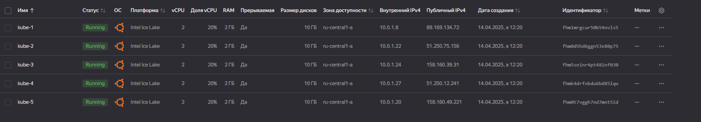
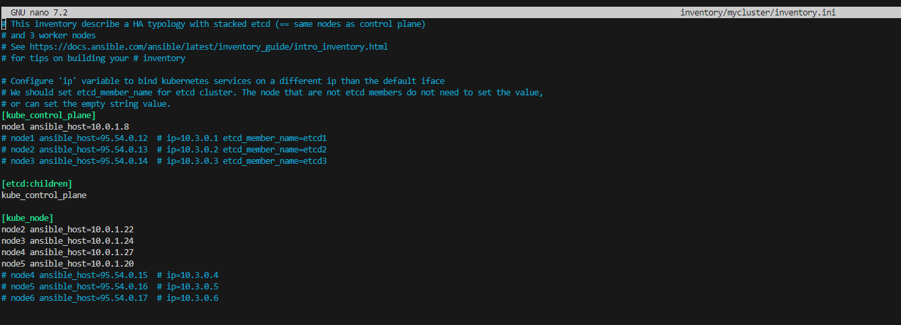
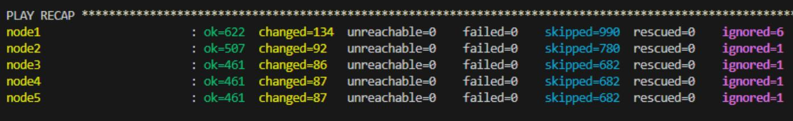
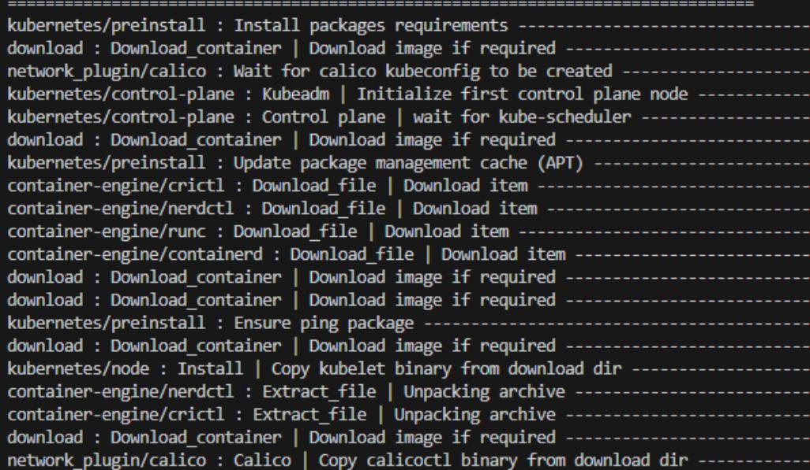
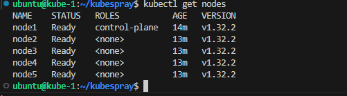
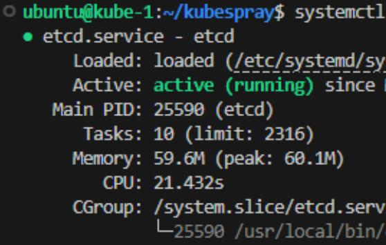

# Домашнее задание к занятию «Установка Kubernetes»

1. Подготовка работы кластера из 5 нод: 1 мастер и 4 рабочие ноды.

Создаем при помощи terraform 5 виртуалок
kube-(1-5)  

  

Добавляем ключ в агент:

```
ssh-add /home/ubuntu/.ssh/netkey.rsa  
```

Копируем ключ на будущую мастер ноду.

Настраиваем ssh к другим серверам (или указываем ключ в анисбл

```
eval "$(ssh-agent -s)"  
ssh-add /home/ubuntu/.ssh/netkey.rsa  
chmod 600 /home/ubuntu/.ssh/netkey.rsa  
```

Подключаемся к системе, обновляем и скачиваем роль, запускаем вирт окружение питона:

```
ssh ubuntu@89.169.134.72  
apt-get update   
git clone https://github.com/kubernetes-sigs/kubespray  
cd kubespray/  
sudo apt install python3.12-venv 
python3 -m venv venv  
source venv/bin/activate  
```

Ставим зависимости:  

```
pip3 install -r requirements.txt  
```

Копируем из примера инвентарь, конфигурируем:  

```
cp -rfp inventory/sample inventory/mycluster
nano inventory/mycluster/inventory.ini
```

  
[inventory.ini](./files/inventory.ini)  

Запускаем:  

```
ansible-playbook -i inventory/mycluster/inventory.ini cluster.yml -b -v  
```

  
  

Добавляем настройки кубадмин:  

```
mkdir -p $HOME/.kube
sudo cp -i /etc/kubernetes/admin.conf $HOME/.kube/config
sudo chown $(id -u):$(id -g) $HOME/.kube/config
```

Проверяем:  

```
kubectl get nodes
```

  

2. В качестве CRI — containerd.  

В плейбуке:  
/home/ubuntu/kubespray/inventory/mycluster/group_vars/k8s_cluster/k8s-cluster.yml  
Указано:  

```
container_manager: containerd  
```  

3. Запуск etcd производить на мастере.  

В инвентори файле указано:  

```
[etcd:children]
kube_control_plane
```

Проверяем на мастер ноде  

```
systemctl status etcd
```

  

4. Способ установки выбрать самостоятельно.  
Выбран **Kubespray**
