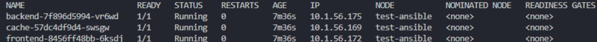

# Домашнее задание к занятию «Как работает сеть в K8s»

Создадим манифесты.  
deployments:  
[frontend](./files/frontend.yaml)  
[backend](./files/backend.yaml)  
[tecachet](./files/cache.yaml)  

network policy:  
[np](./files/policy.yaml)  

services:  
[svc-frontend](./files/svc-frontend.yaml)  
[svc-backend](./files/svc-backend.yaml)  
[svc-cache](./files/svc-cache.yaml)  

Подготавливаем namespace и применяем манифесты:  
```
kubectl create namespace app  
kubectl apply -f ./files/  
```

Проверяем созданные ресурсы:  
```
kubectl get po -o wide -n app
kubectl get deployments -o wide -n app
kubectl get svc -o wide -n app
kubectl get networkpolicies -n app
```

  
  
  
  

Проверяем работу сетевых политик:  

frontend-backend  
```
kubectl exec -it frontend-8456ff48bb-6ksdj -n app -- /bin/bash  
curl svc-frontend:9001  
curl svc-backend:9002  
curl svc-cache:9003  
```
  

Доступен только backend.

backend-cache  
```
kubectl exec -it backend-7f896d5994-vr6wd -n app -- /bin/bash  
curl svc-frontend:9001  
curl svc-backend:9002  
curl svc-cache:9003  
```

  

Доступен только cache.


Cache ко всем:  
```
kubectl exec -it cache-57dc4df9d4-swsgw -n app -- /bin/bash  
curl svc-frontend:9001  
curl svc-backend:9002  
curl svc-cache:9003  
```

  

Ни один сервис не отвечает.