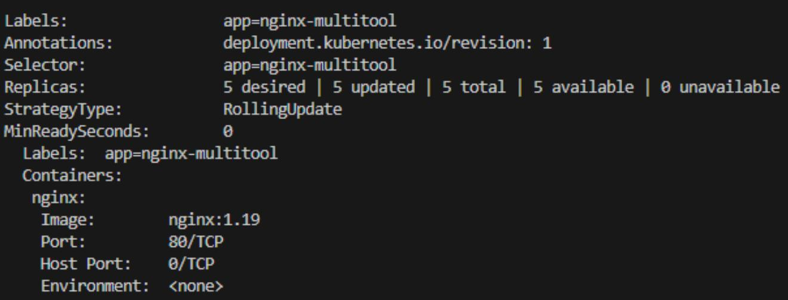
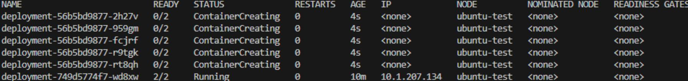
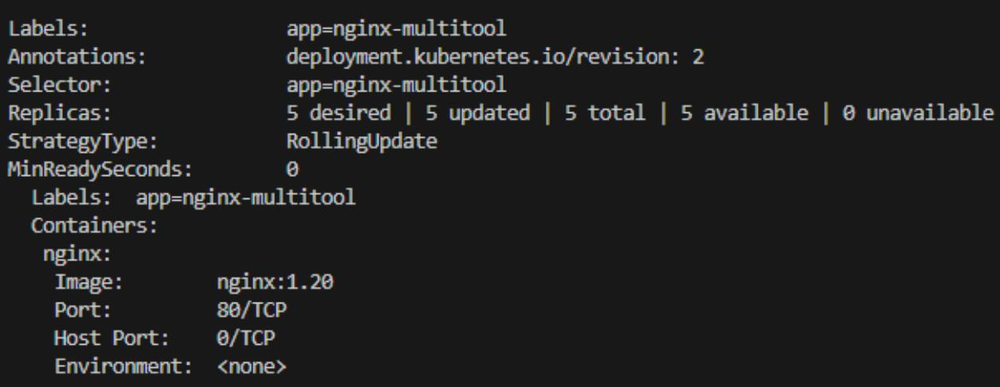
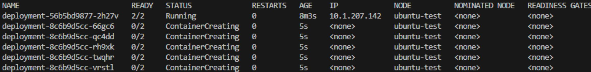
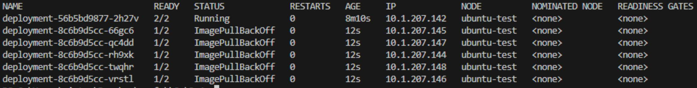
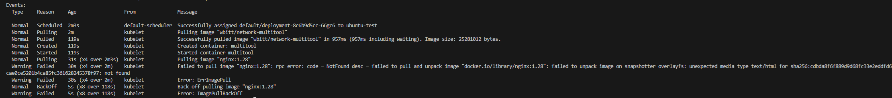
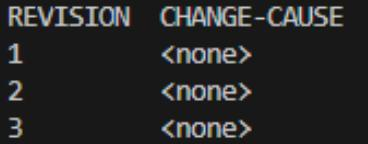
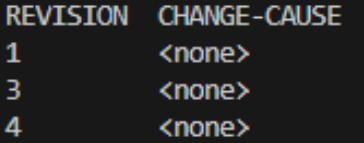
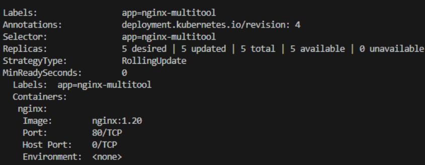

# Домашнее задание к занятию «Обновление приложений»

### Задание 1. Выбрать стратегию обновления приложения и описать ваш выбор

### Blue-Green

С учетом ограничений и несовместимости версий, blue-green — наиболее безопасный подход.

Пошаговая стратегия:

1. Создаем новый Deployment с новой версией приложения и одной репликой.
2. Настраиваем временный сервис (или используем другой selector), чтобы протестировать новую версию изолированно.
3. Проводим функциональное и нагрузочное тестирование новой версии.
4. Уменьшаем количество реплик старого Deployment, чтобы освободить ресурсы.
5. Увеличиваем реплики новой версии и переключаем основной сервис (Service) на новую версию (обновив selector).
6. Удаляем старую версию, если всё прошло успешно.

Преимущества:

1. Позволяет проверить работоспособность до переключения трафика.
2. Откат возможен мгновенно, просто вернув селектор сервиса.
3. Минимизируется риск полного даунтайма.

Ограничения:

* Нельзя держать две полные копии приложения одновременно (по ресурсам), но можно чередовать уменьшение старой версии с увеличением новой.

Вывод:  
С учетом несовместимости версий и ограничений по ресурсам, наиболее подходящей стратегией является blue-green с частичным масштабированием. Это позволит протестировать новую версию с минимальным риском и при этом избежать полного простоя.


### Задание 2. Обновить приложение


Создаем манифест с указанными в задаче параметрами:  

[deployment](./files/deployment.yaml)  

Применяем манифест:  
```
kubectl apply -f ./files/deployment.yaml  
```

Проверяем версию:  

```
kubectl get po -o wide  
kubectl get deployment -o wide  
kubectl describe deployment deployment 
```


```
kubectl describe deployment deployment
``` 

 
  


Обновляем до версии nginx:1.20:  


Меняем в манифесте версию:  
```
image: nginx:1.20  
```  

Добавляем блок со стратегией обновления.   
Параметры maxUnavailable и maxSurge выставляем на значения, необходимые для максимально быстрого апдейта (не рекомендуется в продакшене) 

```
  strategy:  
    type: RollingUpdate  
    rollingUpdate:  
      maxUnavailable: 4  
      maxSurge: 100%  
```


Применяем и повторяем  проверку:  
```
kubectl apply -f ./files/deployment.yaml  
kubectl get po -o wide  
kubectl get deployment -o wide  
```

Поды начали пересоздаваться:  

  

Ожидаем завершения процесса и проверяем версию:  
```
kubectl describe deployment deployment 
```

  

Пытаемся обновиться до версии nginx:1.28.

Теперь обновляемся до несуществующей версии.   
Меняем версию на:  
```
image: nginx:1.28  
```

Пытаемся применить: 

```
kubectl apply -f ./files/deployment.yaml  
kubectl get po -o wide  
```

  
  

Поды не поднимаются из-за ошибки ImagePullBackOff в одном из контейнеров.  
Проверяем, с каким именно подом проблема (предполагается, что мы не знаем из-за чего возникла ошибка)  

```
kubectl describe po deployment-8c6b9d5cc-66gc6
```  
В событиях видим ошибку, при попытке запулить образ nginx:1.28  
```
Failed to pull image "nginx:1.28": rpc error: code = NotFound  
```  

  

Откатываемся после неудачного обновления.

Смотрим историю обновлений:  
```
kubectl rollout history deployment deployment  
```
Откатываемся:  
``` 
kubectl rollout undo deployment/deployment
```

  
  

Проверяем версию nginx:  
```
kubectl describe deployment deployment 
```

Версия снова 1.20  

  
