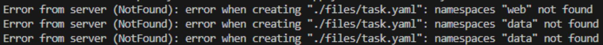
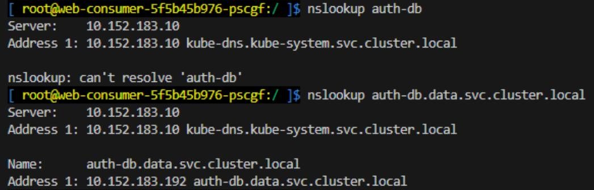
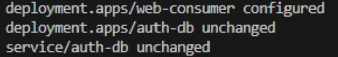
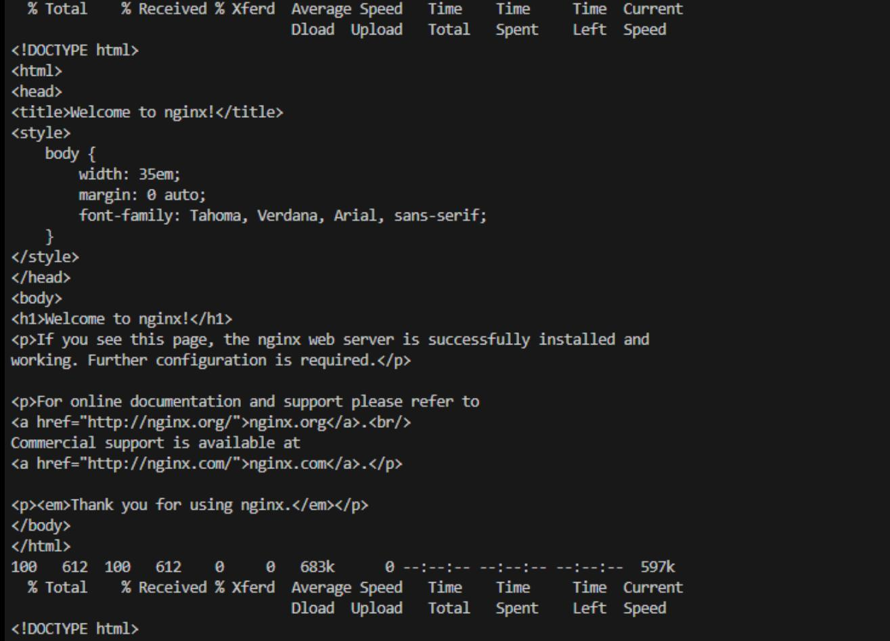

# Troubleshooting

Скачал репозиторий (чтобы можно было менять манифест).
Запускаем манифест:  

```
kubectl apply -f ./files/task.yaml
```

Видим предупреждение об отсутствующих namespace.  

  

Создаем namespace:  

```
kubectl create namespace web
kubectl create namespace data
```

Применяем снова:  

```
kubectl apply -f ./files/task.yaml
```

И deployments и service  успешно запускаются.  
Но, поскольку у нас разные namespace, то в deployment web-consumer вместо,

```
curl auth-db
```

нужно указывать:

```
curl auth-db.data.svc.cluster.local
```

То есть FQDN.

Проверяем это на запущенном поде:  

```
kubectl exec -it web-consumer-5f5b45b976-pscgf -n web -- /bin/bash  
nslookup auth-db
```

Не может зарезолвиться:  

```
nslookup auth-db.data.svc.cluster.local  
```

Работает!  

  

Меняем команду curl в манифесте на вариант с FQDN, применяем:  

```
kubectl apply -f ./files/task.yaml 
```

Проверяем на наличие проблем:  

```
kubectl.exe logs pod/web-consumer-667db765d5-nn945 -n web  
```

Всё работает:  

  
  

Исправленный манифест [task.yaml](./files/task.yaml)
